# README

Author: 袁玉润

> NOTE: see `README.pdf` for a better view of this document. 

## Introduction

This project is intended to parse the input propositional logic formula and generate the corresponding Reduced Ordered Binary Decision Diagram(ROBDD). 

For instance, the input formula $(p\rightarrow r)\wedge (q \leftrightarrow (r \vee p))$ would lead to the following output

```DOT
(p -> r) & (q <-> (r | p))
digraph{
    0 [label="false"]
    1 [label="true"]
    2 [label="p"]
    3 [label="r"]
    4 [label="r"]
    2 -> 3 [label="0"]
    2 -> 4 [label="1"]
    5 [label="q"]
    6 [label="q"]
    3 -> 5 [label="0"]
    3 -> 6 [label="1"]
    5 -> 1 [label="0"]
    5 -> 0 [label="1"]
    6 -> 0 [label="0"]
    6 -> 1 [label="1"]
    4 -> 0 [label="0"]
    4 -> 6 [label="1"]
}
```

which is [DOT](http://www.graphviz.org/doc/info/lang.html) code. To visualize the diagram, one choice is to paste the generated code to [Viz.js (viz-js.com)](http://viz-js.com/). The example show above would generate the following graph

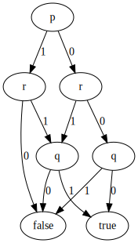

### The Formula Grammar

#### Operators

The supported operations (in descending priority order): 

1. `!` Not
2. `&` And
3. `|` Or
4. `->` Implication, `<->` Equivalence

Parentheses `(`, `)` can be used to alter the priority of the subexpressions. 

#### Variables and Constants

The identifier of the variables should **consist of case-sensitive alphabetic characters and digits** (`[a-zA-Z0-9]+`). 

2 names are reserved: `T` for true and `F` for false. 

For instance: 

1. `T -> F`

   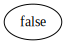

2. `p -> F`

   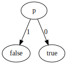

## Build

The project is written completely in [Rust Programming Language](https://www.rust-lang.org/). To build the project from source, follow the instructions on [Install Rust](https://www.rust-lang.org/tools/install) to get the Rust compilation toolchain. The installation is supposed to be easy. If you do not want to rebuild the project, you can run the binary files located in directory `bin` (see [Run](#Run)). 

With the tool chain ready, simply use `cargo ` to build and run the program. One thing to notice is that the file `src/formula_parser/grammar.rs` is generated by [lalrpop/lalrpop: LR(1) parser generator for Rust (github.com)](https://github.com/lalrpop/lalrpop) from `src/formula_parser/grammar.lalrpop`. If you change the contents in `grammar.lalrpop`, a conversion is needed to update the `grammar.rs`. The following instructions should do the work: 

```bash
$ cargo install lalrpop 		# only if you have not installed it
$ lalrpop grammar.lalrpop
```

## Run

The released `x86_linux-gnu` binary is located at `bin/command_line_interface`. 

After executing the program, input the propositional logic formula and then hit `Enter`. 


To visualize the diagram, paste the output to [Viz.js (viz-js.com)](http://viz-js.com/): 

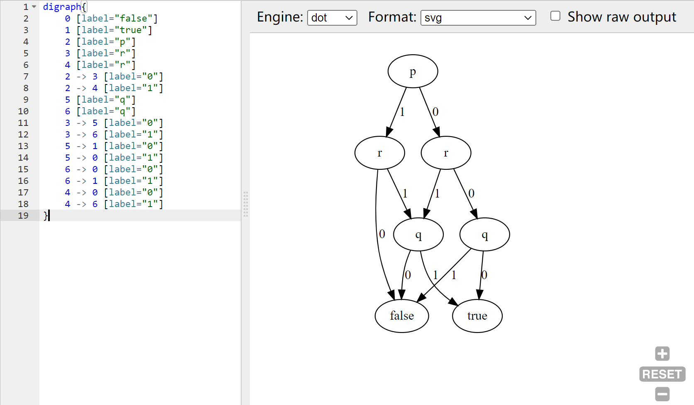

## Examples & Tests

1. `F`

   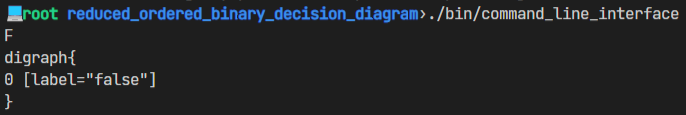

2. `variable`

   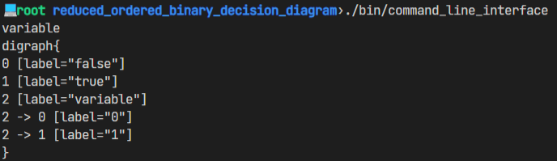

   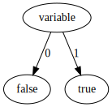

3. `(!x1 | x2) & (x1 | !x3) & (!x1 | !x2 | x3)`

   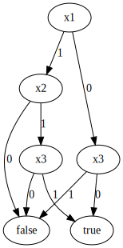

4. `x1 & x2 | x3 & x4 | x5 & x6 | x7 & x8`

   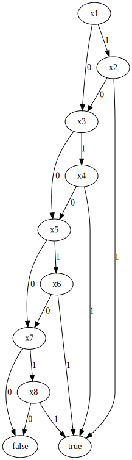

5. `a & b & c | !b & d | !c & d`

   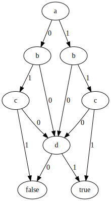

## Implementation

In this section, I would elucidate how I realized this ROBDD generator. 

### Data Structure: A Reduced Binary Tree

The structure of the primary date structure, that is, the one used to represent the BDD, is virtually the same as the diagrams shown above: each node has exactly 2 children and any number of parents; each node can represent a propositional logic formula. 

The nodes can never be duplicate since any addition of node to the graph would be check. This would be further discussed in [Merge and Elimination](#Merge and Elimination). 

#### Inside a Node

The data structure maintains several field for each node: 

1. The left and right child of the node

2. The value of the node, i.e, what the node represents

   This can be either a variable or a Boolean constant. 

3. The parents of this node

   A node would maintain 2 sets of parents. One for the parents of which the node is the left child of, and one for the right. This field is primarily used for [merge and elimination](#Merge and Elimination). 

   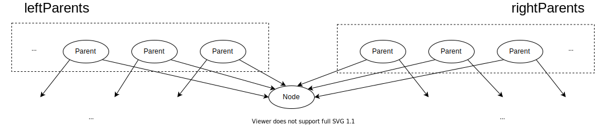

#### Merge and Elimination

Every time a node is about to be added to the tree, duplication detection would be performed to eliminate duplicate/useless node. 

Let $n.val$ denote the variable that the new node $n$ represents, $n.\text{left}$ and $n.\text{right}$ denote the existing left and right child of the new node. The method `add_node_checked(n.value, n.left, n.right)` would either find an existing eligible node or add a new node to the tree and returns a pointer to it. 

1. Eliminate redundant tests

   If $n.\text{left}=n.\text{right}$, simply returns the child. 

2. Merge equivalent leaves

   There are only 2 leaves in the tree: one for `true` and one for `false`. 

3. Merge isomorphic nodes

   node $x$ and node $y$ are isomorphic if and only if

   1. $x.left=y.left$, and
   2. $x.right=y.right$, and
   3. $x.value=y.value$

   To efficiently determine if there is an existing node isomorphic to $n$, the program utilize the data field `parents` of the children, searches among $n.\text{left}.\text{rightParents }\bigcap n.\text{right}.\text{leftParents}$ for a node that has the same value as the new node. 

### Algorithm

The algorithm works in a recursive approach. It traverses the parse tree in depth-first order and employee function `apply()` on each operator node with its subtrees. 

The pseudo code is as follows: 

```c
BDD_node construct_ROBDD(parse_tree_node){
    if (parse_tree_node is a constant) { 		    	// `T` or `F`
        return BDD::get_leaf(constant);
    }else if (parse_tree_node is a variable){	    	// variable like `p`, `q`
        return BDD::add_variable(name);			    	// a single-variable formula
    }else if (parse_tree_node is a binary operator){	// `And`, `Or`, `Implication`, `Equivalence`
        BDD_node left_subtree = construct_ROBDD(parse_tree_node.left);
        BDD_node right_subtree = construct_ROBDD(parse_tree_node.right);
        return apply_binary(op, left_subtree, right_subtree);
    }else{												// unary operator `Not`
        BDD_node subtree = construct_ROBDD(parse_tree_node.child);
        return apply_binary(op, subtree);
    }
}
```

Line 2-5 handles the basic case where the node is a constant or variable. Line 6-12 invokes `apply` on the operator node depending on whether the operator is a binary one or a unary one. 

#### `apply`

Function `apply()`  constructs a new formula based on the given operator and existing operands. 

##### `apply_binary(op, left, right)`

1. Basic case

   If either `left` or `right` is a constant, the new formula is a constant or determined by the other operand. 

   e.g, `apply_binary(And, false, right) = false`, `apply_binary(Or, false, right) = right`

2. If left and right have the same *smallest* variable, apply `op` on the grandchildren and add a new node with obtained children. 

   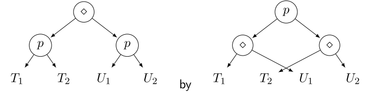

3. If the smallest variables appears on only one side, apply `op` on the grandchildren and children and add a new node with obtained children. 

   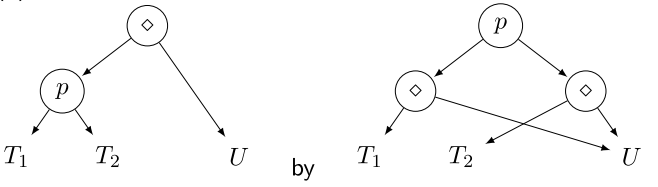

##### `apply_unary(op=Not, node)`

1. Basic case

   If `node` is a constant, returns the negation of it. 

2. otherwise, `node` is a variable. Obtain the negation of its children by `apply_unary(op, node.left)`, `apply_unary(op, node.right)` and add a new node with obtained children. 

   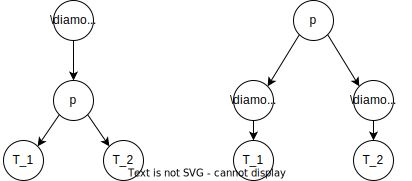

#### Variable Ordering

The order of variables is automatically determined by the program. It uses a simple strategy: the variable appearing earlier in the formula has a higher priority, and therefore appears closer to the root in the BDD. 

## Code Structure

All the source files are located in `src/`. 

```bash
src/
├── bin
│   └── command_line_interface.rs
├── binary_decision_diagram
│   ├── binary_index.rs
│   ├── mod.rs
│   └── node_handler.rs
├── formula_parser
│   ├── grammar.lalrpop
│   ├── grammar.rs
│   └── mod.rs
├── lib.rs
└── utility.rs
```

1. `binary_decision_diagram`

   Implementation of the data structure `BinaryDecisionDiagram`, which represent the reduced binary tree. 

2. `lib.rs`

   Implementation of the core algorithms, including `apply_binary`, `apply_unary`, mapping the variable names to numeric indices, constructing ROBDD from the parse tree. 

3. `formula_parser`

   Construct a parse tree from the input string. 

## Acknowledgement

[Course slide 5.2](http://staff.ustc.edu.cn/~huangwc/fm/5.2.pdf)